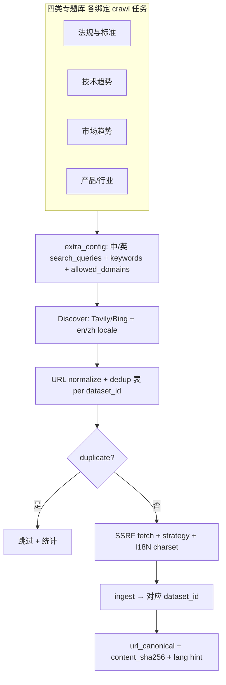

# TBOX 阶段 67 — G2 全网发现、智能去重与中英文爬取（P1 优先）

> **触发**：5180 手测（[`TBOX_5180_HANDTEST_2026-06-02.md`](../../TBOX_5180_HANDTEST_2026-06-02.md)）— 种子 `https://www.cttic.cn/` 仅入库门户首页 `page.html`；产品期望 **公网自动发现** + **重复内容去重** + **英文资料**；且不限于法规库，**四类专题知识库**均需同一套能力。
>
> **设计 Spec（已批准）**：[`2026-06-02-tbox-g2-discover-dedup-design.md`](../specs/2026-06-02-tbox-g2-discover-dedup-design.md)
> **矩阵**：[`2026-05-24-tbox-capability-matrix-design.md`](../specs/2026-05-24-tbox-capability-matrix-design.md) — **G2-CRAWL-DISCOVER**、**G2-CRAWL-DEDUP**、**G2-CRAWL-I18N**、（P2）**G2-CRAWL-RELEVANCE**；**§6 Phase 67**。

**Goal：** 在现有 `static_web` / worker tick 之上，为 **四类专题知识库** 提供统一的 **「搜索词（中/英）→ URL 队列 → 去重 → 抓取入库」** 能力；每个 crawl 任务绑定一个 `dataset_id`（目标库），共享 discover/dedup 引擎、按库配置 query/关键词/域名。

### 四类专题知识库（产品范围）

| 域 | 典型 `dataset` 命名示例 | 发现 query 示例（中/英） |
|----|---------------------------|---------------------------|
| **法规与标准** | TBOX-法规 | `TBOX 车联网 标准 法规` · `C-V2X TBOX standard regulation` |
| **技术发展趋势** | TBOX-技术趋势 | `车联网 TBOX 技术架构 白皮书` · `automotive TBOX technology trend` |
| **市场与产业趋势** | TBOX-市场趋势 | `TBOX 市场规模 产业链` · `connected vehicle TBOX market report` |
| **产品与行业情报** | TBOX-产品 / TBOX-行业 | `TBOX 产品 竞品` · `telematics box vendor comparison` |

**非目标（本 Phase）**：单任务自动创建四个库（库仍由 `/documents` 或运维预先创建）；本 Phase 交付 **能力** + **每库可配置 crawl 任务模板**。

**Architecture（草案）：**

**Tech Stack：** 复用 `common/tbox_crawl_ssrf_fetch.py`、`common/tbox_crawl_strategy.py`、`api/db/services/tbox_crawl_ingest_service.py`；新增 discover/dedup/i18n 模块与 `tbox_crawl_seen` 表；`/crawl` UI 扩展。

**借鉴 RAGFlow 上游：**

- `common/data_source/rest_api_connector.py` — `hash128` 稳定 `doc_id`
- `common/data_source/interfaces.py` — `IncrementalCapability`（FINGERPRINT）
- `rag/utils/tavily_conn.py` — 搜索 API（入库侧复用，与对话侧 Key 文档分离）
- `tools/firecrawl/` — 可选增强英文/动态页抓取

---

## Task 1: 需求与 API 边界（文档）

**Files:**
- Modify: `docs/TBOX_API_BOUNDARY.md` §1.2–1.4

- [ ] **`tbox_crawl_search_queries`** — 字符串数组（支持中英多行）
- [ ] **`tbox_crawl_search_locale`** — `zh` | `en` | `both`（默认 `both`）
- [ ] **`tbox_crawl_search_provider`** — `tavily` | `bing` | `none`
- [ ] **`tbox_crawl_discover_max_urls`** — 单次 tick 发现上限
- [ ] **`tbox_crawl_dedup_scope`** — `dataset`（默认）| `tenant`
- [ ] Dedup 存储：`tbox_crawl_seen`（`dataset_id`, `url_canonical`, `content_sha256`, `lang`, `last_seen_at`）
- [ ] 合规：域名白名单 + 公网爬取确认文案（Harness §9.4）

---

## Task 2: URL 发现（G2-CRAWL-DISCOVER）

**Files（计划）:**
- Create: `common/tbox_crawl_discover.py`
- Modify: `api/db/services/tbox_crawl_task_service.py`

- [ ] `discover_urls(queries, locale, provider, max_urls, allowed_domains) -> list[str]`
- [ ] 中英 query 分别或合并调用 provider；结果 merge 后域名过滤
- [ ] 无 API Key 时降级：**curated 种子 YAML**（按四类库维护运维清单）
- [ ] 单元测试：mock 中英文搜索响应

---

## Task 3: 智能去重（G2-CRAWL-DEDUP）

**Files（计划）:**
- Create: `common/tbox_crawl_dedup.py` + DB migration
- Modify: `tbox_crawl_ingest_service.py`

- [ ] URL 规范化（scheme、host、去 fragment、尾斜杠、常见 tracking 参数）
- [ ] 内容 `sha256`；同 hash 跳过（跨 tick、同 `dataset_id`）
- [ ] 可选 `tenant` 级 dedup（同一 URL 不入多个库 — 产品默认 **per dataset**）
- [ ] tick 摘要：`discovered N, ingested M, skipped_dup K`
- [ ] 单元测试 + ingest 集成测试

---

## Task 4: 中英文抓取（G2-CRAWL-I18N）

**Files（计划）:**
- Modify: `common/tbox_crawl_ssrf_fetch.py` / `suggested_filename_from_url`
- Modify: `web-tbox/src/utils/documentOriginal.ts`（已有 preview；补 Content-Type / charset）

- [ ] Accept-Language / UTF-8 默认可配置
- [ ] 英文 PDF/HTML 正确 preview 与 deepdoc 解析路径
- [ ] 文件名保留 ASCII 安全名 + 可选 `lang` metadata（`extra_config` 或 doc meta）
- [ ] 手测：至少 1 条英文 URL 入 **TBOX-技术趋势** 或 **TBOX-市场趋势** 库

---

## Task 5: `/crawl` UI + 四类库任务模板

**Files:**
- Modify: `web-tbox/src/pages/CrawlPage.tsx`、新建 `crawlExtraDiscover.ts`
- Modify: `docs/TBOX_UI_ACCEPTANCE_WALKTHROUGH.md` — 步骤 G 增补 discover/dedup/i18n

- [ ] 表单：**搜索词（中/英）**、locale、发现上限、dedup 范围说明
- [ ] 快捷模板：四类库各一组默认 query（可编辑）
- [ ] 任务列表展示 discover/dedup 统计
- [ ] typecheck + `tbox_rebuild_console.sh`

---

## Task 6（P2）: 相关性过滤 G2-CRAWL-RELEVANCE

- [ ] 按库类型加载不同 scoring 规则/LLM prompt
- [ ] 低于阈值不入库，写入 tick 摘要

---

## 验收

- [ ] `uv run pytest` discover + dedup + i18n 单测
- [ ] 端到端：**四个库各 1 个 crawl 任务**（或 2 库 smoke + 2 库文档化）— 发现 URL → 重复 run 不重复入库
- [ ] 至少 **1 条英文** 页面成功 preview + 解析
- [ ] 矩阵 **G2-CRAWL-DISCOVER / DEDUP / I18N** → ✅
- [ ] Harness §9.0 Phase 67 行勾选
- [ ] 更新 [`TBOX_5180_HANDTEST_2026-06-02.md`](../../TBOX_5180_HANDTEST_2026-06-02.md) 复测结果

---

## 上游对照（摘要）

| 能力 | 官方 RAGFlow | TBOX 借鉴 |
|------|--------------|-----------|
| 定时爬取入 KB | ❌ 无等价 `/crawl` | 自研 worker 继续为主干 |
| Connectors + hash128 | ✅ | dedup / doc id |
| Tavily 搜索 | ✅ 对话侧 | **DISCOVER** 入库侧 |
| Firecrawl | ⚠️ 可选插件 | 英文/动态页备选 |

**Plan saved to:** `docs/superpowers/plans/2026-06-02-tbox-g2-discover-dedup-plan.md`
