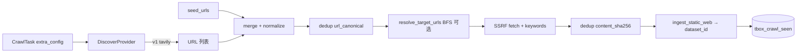

# TBOX G2 搜索发现、智能去重与中英文爬取 — 设计规格

> **状态**：已批准（2026-06-02 brainstorming）
> **矩阵**：G2-CRAWL-DISCOVER、G2-CRAWL-DEDUP、G2-CRAWL-I18N；（P2）G2-CRAWL-RELEVANCE
> **Phase**：67（[`2026-06-02-tbox-g2-discover-dedup-plan.md`](../plans/2026-06-02-tbox-g2-discover-dedup-plan.md)）
> **手测背景**：[`TBOX_5180_HANDTEST_2026-06-02.md`](../../TBOX_5180_HANDTEST_2026-06-02.md)

---

## 1. 目标与非目标

### 1.1 目标

在现有 TBOX crawl worker（`static_web` + `tbox_crawl_strategy` + `tbox_crawl_ingest_service`）之上，为 **四类专题知识库** 提供统一能力：

1. **搜索发现（DISCOVER）**：中/英 search query → 公网候选 URL 队列（v1：**Tavily**；provider **可插拔**，v2 预留 **SearXNG**）。
2. **智能去重（DEDUP）**：URL 规范化 + 内容 `sha256`，按 **`dataset_id`** 跨 tick 跳过重复。
3. **中英文抓取（I18N）**：英文页面可 fetch、preview、deepdoc 解析（v1 最小：`Accept-Language` + charset 处理）。

每个 crawl 任务绑定 **一个** `dataset_id`；四类库各建任务，共享 discover/dedup 引擎，配置不同 query / 关键词 / 允许域名。

### 1.2 四类专题知识库

| 域 | 典型库名 | discover query 示例（中 / 英） |
|----|----------|--------------------------------|
| 法规与标准 | TBOX-法规 | `TBOX 车联网 标准 法规` · `C-V2X TBOX standard regulation` |
| 技术发展趋势 | TBOX-技术趋势 | `车联网 TBOX 技术架构 白皮书` · `automotive TBOX technology trend` |
| 市场与产业趋势 | TBOX-市场趋势 | `TBOX 市场规模 产业链` · `connected vehicle TBOX market report` |
| 产品与行业情报 | TBOX-产品 / TBOX-行业 | `TBOX 产品 竞品` · `telematics box vendor comparison` |

### 1.3 非目标（v1）

- 单任务自动创建四个知识库。
- MCP / Agent 编排作为 discover 主路径。
- 微软 **Bing Search API v7**（已退役）；Azure Grounding 不在 v1 范围。
- **G2-CRAWL-RELEVANCE**（LLM 入库前评分）— Phase 68+。
- 租户级 dedup（默认同 URL 可入不同专题库）。

### 1.4 成功标准（v1 smoke）

| 项 | 标准 |
|----|------|
| Discover | 1 个库（建议 TBOX-法规）+ Tavily + ≥2 条 query → tick 发现 ≥2 个不同 URL 并入库 |
| Dedup | 同一任务 **再执行一次** → tick 摘要 `skipped_dup > 0`，无大量 `page(1).html` |
| I18N | ≥1 条 **英文** discover URL 在 TBOX-技术趋势或 TBOX-市场趋势库 preview 200 |
| 成本 | 开发阶段 Tavily **Researcher 免费档**；默认配额见 §5.3 |
| 兼容 | `tbox_crawl_search_provider=none` 或未设 discover 键时，行为与现网 **仅 seed + BFS** 一致 |

---

## 2. 架构

### 2.1 推荐方案：Discover 独立模块（方案 2）

不在 Agent/MCP 中实现 discover；在 **`common/`** 新增模块，由 **`execute_crawl_task_stub_tick`** 编排：



### 2.2 与现有组件关系

| 现有 | 变更 |
|------|------|
| `common/tbox_crawl_strategy.py` | discover URL 与 seed **合并后**再 `resolve_target_urls`（BFS/域名/关键词不变） |
| `common/tbox_crawl_ssrf_fetch.py` | 可选 `Accept-Language`；fetch 后算 `content_sha256` |
| `api/db/services/tbox_crawl_ingest_service.py` | ingest 前 `should_skip_duplicate` |
| `api/db/services/tbox_crawl_task_service.py` | tick 开头调用 discover + 写 tick 统计摘要 |
| `rag/utils/tavily_conn.py` | crawl 侧 **复用 search 逻辑**；Key 来源与对话侧 **分离** |

### 2.3 未来扩展（不在 v1 实现）

| 能力 | 路径 |
|------|------|
| SearXNG 自托管 | `DiscoverProvider` 实现 `searxng`，env `TBOX_CRAWL_SEARXNG_BASE_URL` |
| MCP | 可选 v3：worker 调 MCP search tool；v1 不采用 |
| Firecrawl 自托管 | 增强 fetch/动态页，不替代 discover |

---

## 3. Discover Provider

### 3.1 接口

模块：`common/tbox_crawl_discover.py`

```python
@dataclass(frozen=True)
class DiscoverResult:
    urls: list[str]
    provider: str
    queries_executed: int
    raw_result_count: int
    notes: str

class DiscoverProvider(Protocol):
    def discover(
        self,
        queries: list[str],
        *,
        locale: str,
        max_urls: int,
        max_queries: int,
        allowed_domains: tuple[str, ...],
    ) -> DiscoverResult: ...
```

工厂：`get_discover_provider(name: str, extra_config, env) -> DiscoverProvider | None`

### 3.2 Provider 注册表

| name | v1 | 行为 |
|------|----|------|
| `none` | ✅ | 不调用搜索；仅 `seed_urls` + BFS |
| `tavily` | ✅ | 见 §3.3 |
| `searxng` | 预留 | v2；未实现时 PATCH/运行返回明确错误 |

### 3.3 Tavily（v1）

**凭据**（进程 env，不入库、不进 `extra_config`）：

- 首选 `TBOX_CRAWL_TAVILY_API_KEY`
- 回退 `TAVILY_API_KEY`

**无 Key**：tick 失败，`last_error` = `DISCOVER_NO_KEY`（当 `tbox_crawl_search_provider=tavily`）。

**调用**：

- 基于 `TavilyClient.search`（可参考 `rag/utils/tavily_conn.py`）。
- 默认 **`search_depth=basic`**（省 credits；任务 `extra_config.tbox_crawl_tavily_depth` 可设 `advanced`）。
- 默认 **`max_results=5`** per query（任务可配 `tbox_crawl_discover_max_results_per_query`，上限 10）。

**locale**：

| 值 | 行为 |
|----|------|
| `zh` | 仅执行中文 query 列表 |
| `en` | 仅执行英文 query 列表 |
| `both` | 全部 query 各执行一次（不自动翻译；用户在 UI 填中英各若干条） |

**输出**：仅采用结果中的 **`url`**；`title`/`content` 仅用于日志。正文一律 SSRF fetch。

**域名**：discover 返回 URL 后，与现有 `tbox_crawl_allowed_domains` 一致过滤。

### 3.4 SearXNG（v2 预留）

- env：`TBOX_CRAWL_SEARXNG_BASE_URL`（如 `http://searxng:8080`）
- HTTP JSON API：`/search?q=...&format=json`
- 实现同一 `DiscoverProvider` 接口；v1 代码中注册 stub 并文档化。

---

## 4. 任务配置（`extra_config`）

| 键 | 类型 | 默认 | 说明 |
|----|------|------|------|
| `tbox_crawl_search_provider` | string | `none` | `none` \| `tavily`（v2：`searxng`） |
| `tbox_crawl_search_queries` | string[] | — | 搜索词，中英均可 |
| `tbox_crawl_search_locale` | string | `both` | `zh` \| `en` \| `both` |
| `tbox_crawl_discover_max_urls` | int | `10` | 单次 tick discover 合并后 URL 上限 |
| `tbox_crawl_discover_max_queries` | int | `3` | 单次 tick 最多执行几条 query |
| `tbox_crawl_discover_max_results_per_query` | int | `5` | 每条 query 最多取几条结果（≤10） |
| `tbox_crawl_tavily_depth` | string | `basic` | `basic` \| `advanced` |

既有键 **`tbox_crawl_keywords`**、**`tbox_crawl_max_depth`**、**`tbox_crawl_allowed_domains`** 不变：作用于 fetch/ingest 阶段。

**合并规则**：

```
discovered_urls + seed_urls → normalize → dedup(url) → resolve_target_urls(BFS) → fetch → dedup(content) → ingest
```

若 `provider=tavily` 且 queries 非空但 merge 后 0 URL → `DISCOVER_EMPTY`。
若 `provider=none` 且无 seed → 保持现网「无 URL」策略错误。

---

## 5. 去重（DEDUP）

### 5.1 表 `tbox_crawl_seen`

| 列 | 类型 | 说明 |
|----|------|------|
| `id` | PK | uuid |
| `dataset_id` | string | 目标知识库 |
| `url_canonical` | string | 规范化 URL |
| `content_sha256` | string nullable | 正文 hash；URL 阶段可为空 |
| `first_seen_at` | datetime | |
| `last_seen_at` | datetime | |
| `source` | string | `discover` \| `seed` \| `expand` |

**唯一约束**：`(dataset_id, url_canonical)`；可选索引 `(dataset_id, content_sha256)`。

### 5.2 URL 规范化

- scheme 小写，`http`→`https` 不强制（保持原 scheme）
- host 小写，去 `www.` 前缀（与 `tbox_crawl_strategy._normalize_host` 一致）
- 去 fragment；去常见 tracking query（`utm_*`, `fbclid` 等最小集合）
- 尾斜杠：路径非 `/` 时去尾 `/`

### 5.3 两阶段

1. **Pre-fetch**：`url_canonical` 已存在 → 跳过 fetch，计数 `skipped_dup_url`。
2. **Post-fetch**：计算 body sha256；若同 `dataset_id` 已有相同 hash → 跳过 ingest，计数 `skipped_dup_content`；否则 ingest 并 upsert 行。

ingest 成功后更新 `content_sha256`（若 URL 行已存在则 update）。

### 5.4 与 `duplicate_name`

并存：内容 dedup 失败时文件名仍可能 `page(1).html`；dedup 目标是在 ingest 前挡住重复。

### 5.5 范围

默认 **`dataset_id` 级**。不在 v1 提供 `tenant` 级全局 dedup。

---

## 6. I18N（v1 最小）

| 项 | 行为 |
|----|------|
| Request | fetch 时 Header `Accept-Language: zh-CN,en;q=0.9`（env `TBOX_CRAWL_ACCEPT_LANGUAGE` 可覆盖） |
| Charset | 以 `Content-Type` + UTF-8 回退解码（沿用 ssrf_fetch） |
| Preview | 现有 `GET /api/v1/documents/:id/preview`；HTML 英文页浏览器可开 |
| 文件名 | `suggested_filename_from_url` ASCII 安全；不强制中文名 |
| 验收 | 至少 1 英文 URL 入库并 preview 200 |

不在 v1 做自动翻译 query；中英 discover 靠 **用户配置双语 query 列表**。

---

## 7. Worker tick 编排

在 `execute_crawl_task_stub_tick` 中顺序：

1. `parse_strategy(extra)`
2. **若** `search_provider != none`：`discover()` → URLs
3. `merge(seed_urls, discovered)` → `normalize` → `dedup_pre_fetch`
4. `resolve_target_urls(...)`（BFS / 域名）
5. 现有 HTTP probe（可 skip）
6. 对每条 URL：fetch → keyword filter → `dedup_post_fetch` → `ingest_static_web`（单条或批量，保持 `TBOX_CRAWL_INGEST_MAX` 上限）
7. `record_worker_tick(ok, message=summary)` — summary 含 `discovered/ingested/skipped_dup_*`

### 7.1 错误码（`format_crawl_worker_error`）

| 阶段 | code | 含义 |
|------|------|------|
| Discover | `DISCOVER_NO_KEY` | tavily 无 API Key |
| Discover | `DISCOVER_EMPTY` | 0 URL after filter |
| Discover | `DISCOVER_QUOTA` | Tavily 429 / 额度 |
| Discover | `DISCOVER_PROVIDER` | 未知 provider / searxng 未实现 |
| Dedup | `DEDUP_ALL` | 候选全部 duplicate（warning 级，可不 fail tick 若 seed 亦空则 fail） |
| 既有 | `STRATEGY` / `INGEST_*` | 不变 |

---

## 8. UI（`web-tbox` `/crawl`）

### 8.1 表单（v1）

- **搜索发现** 折叠区：
  - Provider：`关闭` / `Tavily`
  - 搜索词（多行 textarea）
  - Locale：`zh` / `en` / `both`
  - 单次发现上限、单次 query 数上限
- **四类库模板** 按钮：填充默认 query（不自动选库）
- 说明：Tavily Key 在 **worker 环境变量**，不入库

### 8.2 列表摘要

最近 tick 解析 `last_error` 与成功摘要（若后端写入 `extra` 或日志字段；v1 可在 `last_error` 为空时写 short note 到 task 更新字段 — 实现计划细化）。

---

## 9. 配额与成本（Tavily 免费档）

| 控制 | 默认值 | 目的 |
|------|--------|------|
| `discover_max_queries` | 3 | 限制每 tick API 调用次数 |
| `discover_max_results_per_query` | 5 | 限制每 query 结果数 |
| `discover_max_urls` | 10 | merge 后上限 |
| `TBOX_CRAWL_INGEST_MAX` | 5（现网 env） | 单次 tick 入库条数 |

开发/5180 smoke 在上述默认值下 **每月 credits 可控**（约 3×5=15 URLs/tick 量级，按执行频率自行估算）。

可选 v1.1：Redis/DB 计数 `TBOX_CRAWL_DISCOVER_DAILY_CAP` per tenant（warn only）。

---

## 10. 测试

### 10.1 单元测试

| 模块 | 用例 |
|------|------|
| `tbox_crawl_discover` | mock Tavily；locale both；域名过滤；无 Key 异常 |
| `tbox_crawl_dedup` | URL normalize；pre/post dedup；同 dataset 隔离 |
| `tbox_crawl_task_service` | tick 集成 mock discover + ingest |

### 10.2 手测 / E2E

1. 配 `TBOX_CRAWL_TAVILY_API_KEY`，任务绑 TBOX-法规，2 中 2 英 query，`allowed_domains` 含 `.gov.cn` 或目标站。
2. 执行一次 → documents 新增 ≥2。
3. 再执行 → 无重复暴增，日志/summary 含 skipped_dup。
4. 英文 query → 技术/市场库 1 条英文 preview。

---

## 11. 版本路线图

| 版本 | 交付 |
|------|------|
| **67.0** | Provider 框架 + Tavily + `tbox_crawl_seen` + UI + 1 库 smoke |
| **67.1** | 四类库 query 模板 + 3 库复制验收 |
| **67.2** | `searxng` provider |
| **68** | G2-CRAWL-RELEVANCE |

---

## 12. 文档与 API 边界

实现前/同步更新：

- `docs/TBOX_API_BOUNDARY.md` §1.2–1.4（新 `extra_config` 键 + env）
- `docs/superpowers/specs/2026-05-24-tbox-capability-matrix-design.md`（G2 行状态）
- `docs/TBOX_UI_ACCEPTANCE_WALKTHROUGH.md` 步骤 G

---

## 13. 修订记录

| 日期 | 变更 |
|------|------|
| 2026-06-02 | 初版：brainstorming 批准；可插拔 Discover（v1 Tavily，v2 SearXNG）；dedup + I18N；四类专题库 |
