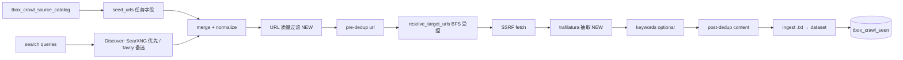

# TBOX G2 爬取内容质量 — 设计规格（Phase 68）

> **状态**：已批准（2026-06-08 brainstorming）
> **优先级**：B 自动发现 → A 正文质量 → C 参考源清单
> **矩阵**：G2-CRAWL-DISCOVER+、G2-CRAWL-EXTRACT、G2-CRAWL-SOURCES；（Phase 69.0–69.2）G2-CRAWL-SELF-HEAL；（Phase 69.3）G2-CRAWL-RELEVANCE
> **Phase**：68（[`2026-06-08-tbox-phase68-plan.md`](../plans/2026-06-08-tbox-phase68-plan.md)）
> **前置**：Phase 67（[`2026-06-02-tbox-g2-discover-dedup-design.md`](2026-06-02-tbox-g2-discover-dedup-design.md)）

---

## 1. 目标与非目标

### 1.1 背景

Phase 67 交付 Discover（Tavily）、dedup、I18N 与四类模板 UI。现网痛点：

- 种子常为**站点首页**，BFS 扩链后入库 **整页 HTML**（`page.html`），RAG 噪声大。
- **Tavily** 在部分部署环境不可达；Discover 降级为 seed+BFS 后质量更差。
- **关键词 substring** 过滤粗糙，易全拒或误收门户页。
- 无**参考源清单**持久化；好 URL 无法沉淀复用。

### 1.2 目标（B → A → C）

| 优先级 | 能力 ID | 说明 |
|--------|---------|------|
| **B** | **G2-CRAWL-DISCOVER+** | **SearXNG** 为 Discover 主路径（Docker 可选）；URL 质量规则过滤低价值链；discover 结果默认不 BFS 扩首页 |
| **A** | **G2-CRAWL-EXTRACT** | **trafilatura** 正文抽取；过短正文跳过；入库 `.txt`；tick 摘要 `skipped_low_quality` |
| **C** | **G2-CRAWL-SOURCES** | DB 表 **`tbox_crawl_source_catalog`**；API CRUD；5180 **导入种子 / 加入参考源** |

### 1.3 验收标准（5180 手测 · 技术趋势专题）

| 项 | 标准 |
|----|------|
| **B** | 任务 **可不填 seed**，`provider=searxng` + query；单次 tick **discovered ≥3**、**ingested ≥2**；URL 非站点根路径（`/``/index.html`） |
| **A** | 入库为抽取正文；抽 10 篇人工或脚本判定 **≥8** 像文章；摘要含 `skipped_low_quality` |
| **C** | catalog 含 tech 专题 ≥3 条；**「从参考源导入种子」** 写入任务；可选 **「加入参考源」** 从文档 URL |

### 1.4 非目标（Phase 68）

- **G2-CRAWL-RELEVANCE**（LLM 入库前评分）→ **Phase 69.3**（**G2-CRAWL-SELF-HEAL** → 69.0–69.2，见 **`2026-06-09-tbox-g2-crawl-self-heal-design.md`**）
- Firecrawl / 无头浏览器 / MCP discover 主路径
- 租户级 dedup（仍按 `dataset_id`）
- 自动把 discover URL 写回 seed（v1 仅 **手动「加入参考源」**）

---

## 2. 架构

### 2.1 流水线（相对 Phase 67 增量）



### 2.2 模块职责

| 模块 | 文件 | 职责 |
|------|------|------|
| SearXNG Discover | `common/tbox_crawl_discover.py` | 实现 `SearxngDiscoverProvider`；env `TBOX_CRAWL_SEARXNG_BASE_URL` |
| URL 质量 | `common/tbox_crawl_url_quality.py` | `filter_urls_by_quality()`；模式 strict/normal/off |
| 正文抽取 | `common/tbox_crawl_extract.py` | `extract_main_text(html, url)` → 复用 `html_utils.parse_html_with_trafilatura` |
| Tick 编排 | `api/db/services/tbox_crawl_task_service.py` | merge 后 URL 质量；discover 源 skip BFS；扩展 `CrawlTickStats` |
| Ingest | `api/db/services/tbox_crawl_ingest_service.py` | fetch 后抽取；`min_extract_chars`；上传 `.txt` |
| 参考源 | `api/db/db_models.py` + `tbox_crawl_source_catalog_service.py` | CRUD + 按 topic 列表 |
| API | `api/apps/tbox_app.py` | `/v1/tbox/crawl/sources` CRUD；`POST …/import-seeds` |
| UI | `web-tbox` CrawlPage + SourcesPanel | provider searxng 默认提示；参考源侧栏 |
| Docker | `docker/docker-compose-base.yml` | 可选 **searxng** 服务 profile |

### 2.3 Provider 优先级

任务 `extra_config.tbox_crawl_search_provider`：

| 值 | 行为 |
|----|------|
| `searxng` | 调自托管 SearXNG JSON API（**推荐默认**） |
| `tavily` | 保持 Phase 67 行为 |
| `none` | 仅 seed + BFS（与现网一致） |

环境变量 **`TBOX_CRAWL_DEFAULT_DISCOVER_PROVIDER`**（可选）默认 `searxng`；未设 SearXNG URL 且 provider=searxng 时 → `DISCOVER_NO_SEARXNG`（可配置 fallback Tavily）。

---

## 3. URL 质量过滤（G2-CRAWL-DISCOVER+）

### 3.1 配置键

| 键 | 类型 | 默认 | 说明 |
|----|------|------|------|
| `tbox_crawl_url_quality_mode` | string | `normal` | `strict` \| `normal` \| `off` |
| `tbox_crawl_discover_skip_bfs` | bool | `true` | discover 合并 URL 不参与 BFS 扩链 |

### 3.2 规则（`normal`）

**跳过**（`skipped_low_quality_url` 计数）：

- 路径为空、`/`、`/index.html`、`/index.htm`
- 路径段匹配：`login`、`signin`、`register`、`download`、`tag`、`tags`、`search`、`cart`
- 路径深度 &lt; 2 **且** 无「文章型」段（`article`、`news`、`post`、`blog`、`202` 年份段等）

**保留**：深度 ≥2 或命中文章型路径；RSS/API 源不受此模块影响。

`strict`：深度 &lt; 3 且无文章型段则跳过。`off`：不过滤。

### 3.3 插入点

`_resolve_crawl_target_urls`：`merge_url_lists(discovered, seeds)` → **URL 质量** → pre-dedup → `resolve_target_urls`（仅 seeds + 非 discover 链 BFS，或 discover_skip_bfs=true 时对 discover 集合单独处理）。

实现策略：对 `discovered` 列表先质量过滤；`seeds` 来自参考源/用户配置 **不过滤**（用户显式指定）；BFS 扩链结果 **再次** 质量过滤。

---

## 4. 正文抽取（G2-CRAWL-EXTRACT）

### 4.1 配置键

| 键 | 类型 | 默认 | 说明 |
|----|------|------|------|
| `tbox_crawl_extract_main_content` | bool | `true` | Phase 68 起 static_web 默认开启 |
| `tbox_crawl_min_extract_chars` | int | `200` | 抽取字符数不足则跳过 |

### 4.2 行为

1. SSRF fetch 得 HTML bytes。
2. `extract_main_text` → UTF-8 文本；失败或 len &lt; min → `skipped_low_quality++`，不入库。
3. 文件名：`{safe_host}_{path_slug}.txt`（非 `page.html`）。
4. `content_sha256` 对**抽取后文本**计算（与 Phase 67 整页 hash 行为变更：更准去重；文档化于 API boundary）。

### 4.3 tick 摘要

扩展 `CrawlTickStats`：

```
discovered=N ingested=N skipped_dup_url=N skipped_dup_content=N skipped_kw=N skipped_low_quality=N
```

---

## 5. 参考源清单（G2-CRAWL-SOURCES）

### 5.1 表 `tbox_crawl_source_catalog`

| 列 | 类型 | 说明 |
|----|------|------|
| `id` | PK uuid | |
| `tenant_id` | string index | |
| `topic` | string index | `regulations` \| `tech` \| `market` \| `product` |
| `label` | string | 展示名 |
| `url` | string 2048 | 栏目或文章 URL |
| `domain` | string | 冗余 host，便于列表 |
| `enabled` | bool | 默认 true |
| `created_by` | string | |
| `status` | char | 1 valid / 0 deleted |
| `create_time` / `update_time` | datetime | |

唯一约束：`(tenant_id, topic, url_canonical_hash)`（hash 列同 `tbox_crawl_seen` 算法）。

### 5.2 API（`/v1/tbox/crawl/sources`）

| 方法 | 路径 | 说明 |
|------|------|------|
| GET | `/v1/tbox/crawl/sources?topic=&page=` | 列表 |
| POST | `/v1/tbox/crawl/sources` | 创建 |
| PATCH | `/v1/tbox/crawl/sources/<id>` | 更新 |
| DELETE | `/v1/tbox/crawl/sources/<id>` | 软删 |
| POST | `/v1/tbox/crawl/tasks/<id>/import-sources` | body: `{ "topic": "tech", "replace": false }` → 合并 catalog URL 到 `seed_urls` |

权限：`crawl.manage`（与任务 CRUD 一致）。

### 5.3 UI（5180 `/crawl`）

- **参考源** 区块：按 topic 筛选、增删改、**导入到当前编辑任务种子**。
- 文档页（68.2 可选）：**加入参考源** → POST catalog（带当前 doc 来源 URL，若 doc 元数据含 `source_url` 或 crawl 写入 `meta`）。

### 5.4 与任务 `seed_urls` 关系

| 数据 | 存储 | 用途 |
|------|------|------|
| 参考源 catalog | `tbox_crawl_source_catalog` | 长期清单、多任务复用 |
| 任务种子 | `tbox_crawl_task.seed_urls` | **实际 tick 起点**；由 catalog 导入或手填 |
| 自动 discover URL | 当次内存 + 入库后 `tbox_crawl_seen` | 不自动进 catalog；用户可「加入参考源」 |

---

## 6. Docker：SearXNG（可选）

### 6.1 Compose

在 `docker/docker-compose-base.yml` 增加 service **`searxng`**（profile `crawl-discover` 或 `full`）：

- 镜像：`searxng/searxng:latest`（或项目钉扎版本）
- 端口：`127.0.0.1:8888` → 容器 8080
- env：`SEARXNG_BASE_URL`；禁用 rate limit 供内网 worker

`docker/.env` 示例：

```bash
TBOX_CRAWL_SEARXNG_BASE_URL=http://searxng:8080
TBOX_CRAWL_DEFAULT_DISCOVER_PROVIDER=searxng
```

`ragflow-cpu` 容器需与 searxng **同 compose 网络**。

### 6.2 SearXNG API

`GET {base}/search?q={query}&format=json&language=zh-CN`（locale 映射见实现）

解析 `results[].url`；域名过滤同 Tavily。

---

## 7. 错误码

| code | 含义 |
|------|------|
| `DISCOVER_NO_SEARXNG` | provider=searxng 但 base URL 未配置或不可达 |
| `URL_QUALITY_EMPTY` | 质量过滤后 0 URL（可选与 STRATEGY 合并文案） |

现有 `DISCOVER_*`、`INGEST_STATIC` 保持；`skipped_low_quality` 全拒时：`all N page(s) skipped by quality filter`。

---

## 8. 测试

| 层级 | 内容 |
|------|------|
| 单测 | `test_tbox_crawl_url_quality.py`；`test_tbox_crawl_extract.py`；mock SearXNG JSON |
| 集成 | tick：discover-only + ingest ≥1 |
| smoke | `scripts/tbox_phase68_crawl_quality_smoke.py` |
| 手测 | 更新 `TBOX_UI_ACCEPTANCE_WALKTHROUGH.md` 步骤 G |

---

## 9. 实施分期

| 子阶段 | 交付 |
|--------|------|
| **68.0** | SearXNG provider + Docker + URL 质量 + smoke B |
| **68.1** | trafilatura ingest + stats + smoke A |
| **68.2** | catalog 表/API/UI + import-seeds + smoke C |
| **69.0** | G2-CRAWL-HEALTH（url_health + crawl/health API） |
| **69.1** | G2-CRAWL-SEED-AUTO（无确认 auto PATCH 种子 + catalog 补种） |
| **69.2** | G2-CRAWL-DISCOVER-AUTO（provider=auto、代理、国内 SearXNG 引擎） |
| **69.3** | G2-CRAWL-RELEVANCE（LLM 可选） |

---

## 10. 文档同步

- `docs/superpowers/specs/2026-05-24-tbox-capability-matrix-design.md` §G2 + §6 Phase 68
- `docs/TBOX_API_BOUNDARY.md` 新键与 `/crawl/sources`
- `docs/TBOX_KB_DELIVERY_HARNESS.md` §S4 / Phase 68
- `docs/TBOX_UI_ACCEPTANCE_WALKTHROUGH.md` 步骤 G

---

## 11. 修订记录

| 日期 | 变更 |
|------|------|
| 2026-06-08 | 初版：brainstorming 批准；B→A→C；DB catalog；SearXNG Docker 主路径 |
