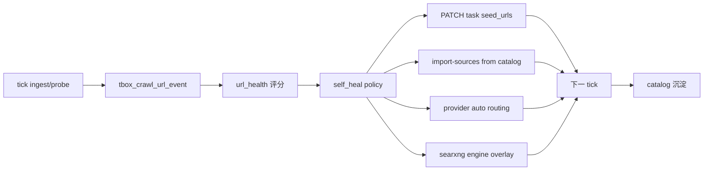

# TBOX G2 爬取自愈与自主优化 — 设计规格（Phase 69.0–69.2）

> **状态**：已批准（2026-06-09）
> **能力 ID**：**G2-CRAWL-SELF-HEAL**（含 69.0 HEALTH / 69.1 SEED-AUTO / 69.2 DISCOVER-AUTO 子能力）
> **矩阵**：[`2026-05-24-tbox-capability-matrix-design.md`](2026-05-24-tbox-capability-matrix-design.md) §G2、§6
> **Plan**：[`2026-06-09-tbox-phase69-plan.md`](../plans/2026-06-09-tbox-phase69-plan.md)
> **前置**：Phase 68（Discover+、EXTRACT、SOURCES）；Phase 67（Discover/Dedup）

---

## 1. 目标与非目标

### 1.1 背景（Phase 68 后仍存在的运维痛点）

| 痛点 | 表现 | 根因 |
|------|------|------|
| **坏种子** | 知乎/CSDN 首页类 URL 反复 `robots` / 低质量 | tick 消费配置，**不把失败经验写回** `seed_urls` |
| **Discover 不可用** | SearXNG 外网引擎全 timeout → `discovered=0` | 无 provider 健康探测与 **自动换路** |
| **误导性错误** | UI「静态页入库失败」 | 单 URL 失败掩盖 partial success / 可自愈场景 |

### 1.2 目标

建立 **Observe → Diagnose → Act → Learn** 闭环，使系统在 **无人工确认** 下：

1. **自动 PATCH 任务**（移除/替换坏种子、从 catalog 补种）。
2. **Discover 智能路由**（SearXNG 引擎自愈 → Tavily 回退 → seed+catalog 降级）。
3. **出站网络适配**（HTTP 代理、国内 SearXNG 引擎白名单）。

### 1.3 已确认策略（产品决策 2026-06-09）

| 决策 | 结论 |
|------|------|
| 坏种子自动 PATCH | **允许，无需用户确认**；须写 audit 可回滚 |
| 出站代理 | 支持 **`TBOX_CRAWL_HTTP_PROXY`**（discover + fetch 共用） |
| SearXNG 引擎 | 支持 **国内引擎白名单** + 运行时禁用 timeout 引擎 |
| RELEVANCE | **顺延 Phase 69.3**（本规格不含 LLM 评分） |

### 1.4 非目标（Phase 69.0–69.2）

- **G2-CRAWL-RELEVANCE**（LLM 入库前评分）→ **69.3**
- 无头浏览器 / Firecrawl
- 跨租户全局种子共享（仍按 `tenant_id` / `task_id`）
- MCP 作为 discover 主路径

---

## 2. 架构

### 2.1 反馈闭环



### 2.2 模块职责

| 模块 | 文件（计划） | 职责 |
|------|--------------|------|
| URL 事件/健康 | `tbox_crawl_url_health` 表 + `tbox_crawl_health_service.py` | tick 埋点；`health_score` |
| 自愈策略 | `common/tbox_crawl_self_heal.py` | 诊断 + 生成 PATCH 动作 |
| Tick 编排 | `tbox_crawl_task_service.py` | tick 后/前调用 self_heal |
| Discover 路由 | `common/tbox_crawl_discover_router.py` | `provider=auto`；SearXNG/Tavily 探测 |
| SearXNG 健康 | `common/tbox_crawl_searxng_health.py` | 引擎 timeout → 禁用列表 |
| 出站代理 | `common/tbox_crawl_ssrf_fetch.py` | `HTTP(S)_PROXY` 注入 requests |
| Audit | `tbox_crawl_self_heal_audit` 表 | 自动 PATCH 记录 |
| API | `tbox_app.py` | `GET /v1/tbox/crawl/health`；`GET …/tasks/<id>/heal-log` |
| UI | CrawlPage | Discover 状态灯；自愈时间线；可关闭 auto-heal |

---

## 3. 数据模型

### 3.1 `tbox_crawl_url_health`

| 字段 | 类型 | 说明 |
|------|------|------|
| `id` | string | PK |
| `tenant_id` | string | 租户 |
| `task_id` | string | 可选；空表示租户级 |
| `url_canonical` | string | 规范化 URL |
| `source` | string | seed \| discover \| expand \| catalog |
| `success_count` / `fail_count` | int | 累计 |
| `last_outcome` | string | ok \| robots \| timeout \| low_quality \| keyword \| dup \| http_error |
| `health_score` | int | 0–100 |
| `auto_disabled` | bool | 系统是否已禁用 |
| `update_time` | datetime | |

索引：`(tenant_id, url_canonical)`；`(task_id, url_canonical)`。

### 3.2 `tbox_crawl_self_heal_audit`

| 字段 | 说明 |
|------|------|
| `task_id` | 被修改任务 |
| `action` | prune_seed \| import_catalog \| set_extra \| disable_engine |
| `before_json` / `after_json` | PATCH 前后快照（`seed_urls` / `extra_config` 子集） |
| `reason` | 规则命中说明 |
| `created_by` | `system:self_heal` |

---

## 4. 子阶段交付

### 4.1 Phase 69.0 — G2-CRAWL-HEALTH（观测）

- tick 内 ingest/probe/discover 结果 **写入 url_health + event**。
- `GET /v1/tbox/crawl/health`：SearXNG 引擎可用率、出站探测、provider 推荐。
- `last_error` 扩展：`TICK_OK_DEGRADED`、`SEED_UNHEALTHY`（诊断用，非必须失败）。

**验收**：连续 3 tick 后 health 表有记录；API 返回 `searxng_engines_ok` 计数。

### 4.2 Phase 69.1 — G2-CRAWL-SEED-AUTO（坏种子自愈）

**规则（默认开启，`tbox_crawl_self_heal_enabled=true`）**

| 条件 | 动作 |
|------|------|
| seed `health_score < 20` 且 `fail_count ≥ 3` | **PATCH 移除**该 URL（**无确认**） |
| 同 topic catalog ≥2 条 `health_score ≥ 60` | **`import-sources`** 补种 |
| discover 成功且 ingested | **写入 catalog**（enabled） |
| 任务 `seed_urls` 清空风险 | 保留 ≥1 条或从 catalog 强制补 1 条 |

**域名启发式（与 url_quality 复用）**

- 路径 `/`、`/index.html`、无 `article|detail|p/` 段 → 降权
- `zhihu.com` 全文 robots 高概率 → 优先 discover 替换，非 PATCH 保留

**验收**：含知乎坏种子的任务，3 tick 内 seed 被替换或移除，audit 有记录，至少 1 次 `ingested≥1`。

### 4.3 Phase 69.2 — G2-CRAWL-DISCOVER-AUTO（Discover 路由）

**Provider 链（`tbox_crawl_search_provider=auto`）**

```
1. probe SearXNG JSON（engines 可用数）
2. 可用率 < tbox_crawl_discover_min_engines → searxng_degraded
3. degraded + TAVILY_KEY → Tavily
4. 全失败 + 有 seed/catalog → seed-only（TICK_OK_DEGRADED）
5. 全失败 + 无 seed → DISCOVER_EMPTY + 触 69.1 catalog 补种
```

**SearXNG 引擎**

- 启动/tick 前：`GET …/search?q=ping&format=json` → 解析 `unresponsive_engines`
- **`TBOX_CRAWL_SEARXNG_ENGINE_ALLOWLIST`**：仅启用国内/可达引擎（如 bing、360、搜狗等，部署实测配置）
- 动态 overlay 禁用 suspended 引擎（Redis 或 settings volume reload）

**HTTP 代理**

| 变量 | 作用 |
|------|------|
| `TBOX_CRAWL_HTTP_PROXY` | discover + SSRF fetch 共用（`requests` proxies） |
| `TBOX_CRAWL_HTTPS_PROXY` | 可选；未设则回落 HTTP_PROXY |

Docker：`docker/.env` 配置，**勿提交 Git**。

**验收**：模拟 SearXNG 全 timeout → auto 切 Tavily 或 degraded 黄灯；配置代理后 `discovered≥1`。

### 4.4 Phase 69.3 — G2-CRAWL-RELEVANCE（顺延）

见独立 spec（待写）；LLM/规则入库前相关性闸门，**不在本规格范围**。

---

## 5. `extra_config` 与 env

### 5.1 任务 `extra_config` 新增键

| 键 | 类型 | 默认 | 说明 |
|----|------|------|------|
| `tbox_crawl_self_heal_enabled` | bool | `true` | 总开关 |
| `tbox_crawl_auto_prune_seeds` | bool | `true` | 无确认自动移除坏种子 |
| `tbox_crawl_auto_import_catalog` | bool | `true` | 自动从 catalog 补种 |
| `tbox_crawl_search_provider` | string | `auto` | auto \| searxng \| tavily \| none |
| `tbox_crawl_seed_health_min_score` | int | `20` | 低于则 prune |
| `tbox_crawl_discover_min_engines` | int | `2` | SearXNG 最少可用引擎数 |

### 5.2 Worker / Docker env

| 变量 | 说明 |
|------|------|
| `TBOX_CRAWL_HTTP_PROXY` / `TBOX_CRAWL_HTTPS_PROXY` | 出站代理 |
| `TBOX_CRAWL_SEARXNG_ENGINE_ALLOWLIST` | 逗号分隔引擎名 |
| `TBOX_CRAWL_SELF_HEAL_INTERVAL_SEC` | 同一任务自愈 PATCH 最小间隔（默认 300） |

---

## 6. API 与契约

- **契约版本**：69.0 实现后 **+1**（新端点/health 字段）。
- **新端点（计划）**：
  - `GET /v1/tbox/crawl/health` — 子系统健康（SearXNG、provider、proxy 探测）
  - `GET /v1/tbox/crawl/tasks/<id>/heal-log` — 分页 audit
- **自动 PATCH**：复用现有 `PATCH /v1/tbox/crawl/tasks/<id>`，调用方为 worker 内部 service（非用户会话）。

---

## 7. UI（5180）

| 区域 | 内容 |
|------|------|
| Discover 区 | 状态灯：绿/黄/红；当前 provider；引擎可用数 |
| 种子列表 | 健康分、最后失败原因；「系统自动管理」开关 |
| 自愈时间线 | 最近 audit：移除/补种/换 provider |
| 高级 | 代理说明链到 Runbook；SearXNG 引擎 allowlist 提示 |

Walkthrough **步骤 G** 增 Phase 69 验收项（69.0 实现 plan 中补）。

---

## 8. 测试

| 层级 | 内容 |
|------|------|
| 单测 | health 评分；prune 规则；provider auto 选择；mock SearXNG unresponsive |
| 集成 | 坏种子 3 次失败 → PATCH 移除；catalog 补种 |
| smoke | `scripts/tbox_phase69_crawl_self_heal_smoke.py` |
| 手测 | 技术趋势任务：去知乎种子后 auto 维持 `ingested≥1` |

---

## 9. 文档同步

- `docs/superpowers/specs/2026-05-24-tbox-capability-matrix-design.md` §G2、§6
- `docs/TBOX_KB_DELIVERY_HARNESS.md` §9.0 S4 / Phase 69
- `docs/TBOX_API_BOUNDARY.md`（69.0 起）
- `docs/TBOX_DEPLOY_RUNBOOK.md` — 代理与 SearXNG 引擎配置专节

---

## 10. 修订记录

| 日期 | 变更 |
|------|------|
| 2026-06-09 | 初版：G2-CRAWL-SELF-HEAL；69.0–69.2；无确认 auto PATCH；代理与国内引擎；RELEVANCE→69.3 |
