# TBOX G2 Discover SERP 预筛 — 设计规格（Phase 70）

> **状态**：已批准（2026-06-22 brainstorming）
> **能力 ID**：**G2-CRAWL-DISCOVER-RANK**
> **矩阵**：G2 爬取质量（Discover 有效性）
> **Phase**：70
> **前置**：Phase 68（[`2026-06-08-tbox-g2-crawl-quality-design.md`](2026-06-08-tbox-g2-crawl-quality-design.md)）、Phase 69.3（[`2026-06-10-tbox-g2-crawl-relevance-design.md`](2026-06-10-tbox-g2-crawl-relevance-design.md)）
> **首要场景**：技术趋势 / 行业资讯（搜索发现 + 文章正文）

---

## 1. 目标与非目标

### 1.1 背景

Phase 68–69 已交付 SearXNG/Tavily Discover、URL path 质量、trafilatura 抽取、参考源 catalog、入库前相关性闸门（默认 `off`）。现网（5180 技术趋势专题）痛点排序：

1. **Discover 结果差（最严重）**：SERP 多为站点首页、栏目列表、门户导航，很少直接命中文章 URL。
2. **正文抽取差（次要）**：fetch 到门户页时 trafilatura 过短或噪声大。
3. **主题偏离（次要）**：无关页面仍入库。

根因：Discover 层**丢弃了 SERP 的 title/snippet**，仅按 URL path 启发式过滤，无法在 fetch 前判断「像不像一篇文章」。

### 1.2 目标

| 优先级 | 能力 | 说明 |
|--------|------|------|
| **P0** | **G2-CRAWL-DISCOVER-RANK** | Discover 保留 **title+snippet**；fetch 前 **SERP 规则预评分**；Top-K 进入 fetch |
| **P1** | **Query 模板** | `tech_trend` 预设生成中英 query；减少人工写 query |
| **P2** | **Tech 默认闸门** | 模板默认 `url_quality=strict`、`discover_rank=rules`、`relevance=rules` |
| **P3** | **抽取 fallback** | 短正文时注入 SERP title；tech 模板 `min_extract_chars=300` |

### 1.3 验收标准（5180 手测 · 技术趋势）

| # | 标准 |
|---|------|
| 1 | 选模板「技术趋势」，query 可留空或 1 条；tick 摘要 `discover_hits ≥ 5` |
| 2 | `skipped_serp_rank ≥ 30% × discover_hits`（说明在挡首页/列表） |
| 3 | `ingested ≥ 2`；入库为 `.txt` 抽取正文 |
| 4 | 抽 10 篇人工判定 **≥ 7** 像独立文章/报告 |
| 5 | `tbox_crawl_source_catalog` tech 专题 **≥ 3** 条；「导入种子」可用 |

### 1.4 非目标（Phase 70）

- 无头浏览器 / Firecrawl / 登录态爬取
- MCP 四域 Airflow 管线改造（仍聚焦 5180 `tbox_crawl_*`）
- 替换 trafilatura 引擎
- **Phase 70.1**：`discover_rank_mode=rules_then_llm`（LLM 对 SERP 边界分重排；v1 仅 spec 预留）
- 自动把高命中 URL 写回 seed（仍仅手动「加入参考源」）

---

## 2. 架构

### 2.1 流水线（相对 Phase 68 增量）

```mermaid
flowchart LR
  Q[search queries] --> T[query 模板扩展 NEW]
  T --> D[SearXNG / Tavily / auto]
  D --> H[DiscoverHit url+title+snippet NEW]
  H --> U[URL path 质量 已有]
  U --> R[SERP 规则预评分 NEW]
  R --> K[Top-K 截断 NEW]
  K --> F[SSRF fetch]
  F --> X[trafilatura + title fallback]
  X --> G[相关性闸门 rules 已有]
  G --> I[ingest .txt → dataset]
  CAT[source_catalog] --> Q
```



### 2.2 数据流

1. **Discover** 返回 `DiscoverResult.hits: list[DiscoverHit]`，同时保留 `urls` 只读属性（`[h.url for h in hits]`）以兼容旧调用方。
2. **URL 质量**（path 规则）作用于 hit.url，跳过计数仍计入 `skipped_low_quality_url`。
3. **SERP 预评分** 对每条 hit 计算 0–100 分；低于阈值丢弃，计数 `skipped_serp_rank`。
4. **Top-K**：按分数降序取前 `discover_max_fetch` 条进入 fetch（默认等于 `TBOX_CRAWL_INGEST_MAX`）。
5. **Fetch → 抽取 → 相关性** 沿用 Phase 68/69.3；tech 模板默认开启 `relevance_mode=rules`。

### 2.3 模块职责

| 模块 | 文件 | 职责 |
|------|------|------|
| DiscoverHit | `common/tbox_crawl_discover.py` | `@dataclass DiscoverHit(url, title, snippet, query)` |
| Provider | 同上 | SearXNG/Tavily 解析 JSON 时填充 title/snippet |
| SERP 预评分 | **`common/tbox_crawl_discover_rank.py`** | `rank_discover_hits()`、`score_discover_hit()` |
| Query 模板 | **`common/tbox_crawl_query_templates.py`** | `apply_query_template(name, extra) → queries[]` |
| Tick 编排 | `api/db/services/tbox_crawl_task_service.py` | discover → quality → rank → dedup → fetch 列表 |
| Ingest | `api/db/services/tbox_crawl_ingest_service.py` | 可选接收 hit metadata 做 title fallback |
| 参考源 | `tbox_crawl_source_catalog_service.py` | tech 预置条目（种子数据 migration 或 bootstrap 脚本） |
| UI | `web-tbox` CrawlPage | 模板选择；tick 摘要展示 rank 统计 |
| Bootstrap | `scripts/tbox_crawl_bootstrap_tech_trend.py` | 改用 auto + rank + relevance |
| Smoke | **`scripts/tbox_phase70_crawl_discover_rank_smoke.py`** | CI/手测 |

---

## 3. DiscoverHit 与 Provider 改造

### 3.1 DiscoverHit

```python
@dataclass(frozen=True)
class DiscoverHit:
    url: str
    title: str = ""
    snippet: str = ""
    query: str = ""
```

### 3.2 DiscoverResult 扩展

```python
@dataclass(frozen=True)
class DiscoverResult:
    hits: list[DiscoverHit]
    provider: str
    queries_executed: int
    raw_result_count: int
    notes: str

    @property
    def urls(self) -> list[str]:
        return [h.url for h in self.hits if h.url]
```

**兼容**：现有 `result.urls` 调用改为 property；单元测试覆盖。

### 3.3 Provider 字段映射

| Provider | JSON 字段 |
|----------|-----------|
| SearXNG | `url`, `title`, `content` → snippet |
| Tavily | `url`, `title`, `content` 或 `raw_content` 截断 → snippet |

---

## 4. SERP 规则预评分（G2-CRAWL-DISCOVER-RANK）

### 4.1 配置键

| 键 | 类型 | 默认 | 说明 |
|----|------|------|------|
| `tbox_crawl_discover_rank_mode` | string | `off` | `off` \| `rules` \| `rules_then_llm`（后者 Phase 70.1） |
| `tbox_crawl_discover_rank_min_score` | int | `55` | 0–100；通过阈值 |
| `tbox_crawl_discover_max_fetch` | int | 空→env | 预筛后最多 fetch；默认 `TBOX_CRAWL_INGEST_MAX` |
| `tbox_crawl_query_template` | string | 空 | `tech_trend` 等 |

### 4.2 规则分（`rules` 模式）

输入：`DiscoverHit` + `topic`（复用 `infer_relevance_topic()`）。

| 信号 | 分值 |
|------|------|
| path 为 `/`、`/index.html` 等 | −40 |
| title 或 snippet 含导航词（首页/登录/Sign in/Home） | −30 |
| path 含 article/news/detail/blog 或年份段 20xx | +15 |
| topic/query 词命中 title 或 snippet（分词 substring） | +10～+25 |
| title 长度 &lt; 8 且无 article path hint | −20 |
| snippet 含「更多」「下一页」「栏目」等列表特征 | −25 |

**通过**：`score >= min_score`。同分按原始 SERP 顺序。

**无 snippet/title**（降级）：仅 URL path 规则 + topic 词是否出现在 path；上限分 70。

### 4.3 与 Phase 69.3 关系

| 阶段 | 输入 | 阈值 | 目的 |
|------|------|------|------|
| Discover rank（本 Phase） | title+snippet+url | 55 | 少 fetch 首页/列表 |
| Relevance（69.3） | 抽取正文 | 60 | 少入库偏题文 |

两道闸独立计数：`skipped_serp_rank` vs `skipped_relevance`。

---

## 5. Query 模板（tech_trend）

### 5.1 行为

当 `tbox_crawl_query_template=tech_trend` 且用户未填 query（或允许合并）：

从 `tbox_crawl_keywords` / 任务名 / 固定 tech 词表生成 **4–6 条** query，例如：

- `{topic} 技术趋势 白皮书`
- `{topic} technology trend whitepaper`
- `{topic} 行业报告 site:gov.cn OR site:miit.gov.cn`（若 allowed_domains 含 gov.cn）
- `车联网 TBOX 架构 2024 2025`

用户已填 query 时：**追加**而非覆盖（可配置 `tbox_crawl_query_template_mode=merge|replace`，默认 `merge`）。

### 5.2 Tech 任务推荐 `extra_config`

```json
{
  "tbox_crawl_search_provider": "auto",
  "tbox_crawl_query_template": "tech_trend",
  "tbox_crawl_url_quality_mode": "strict",
  "tbox_crawl_discover_skip_bfs": true,
  "tbox_crawl_discover_rank_mode": "rules",
  "tbox_crawl_discover_rank_min_score": 55,
  "tbox_crawl_relevance_mode": "rules",
  "tbox_crawl_relevance_min_score": 60,
  "tbox_crawl_min_extract_chars": 300,
  "tbox_crawl_keywords": ["车联网", "TBOX", "技术", "智能网联"]
}
```

**种子 URL**：避免纯首页；优先 catalog 栏目 deep link；bootstrap 脚本去掉 `https://www.miit.gov.cn/` 根路径 seed。

---

## 6. Tick 统计与 API

### 6.1 CrawlTickStats 扩展

| 字段 | 说明 |
|------|------|
| `discover_hits` | SERP 原始条数（质量过滤前或后，实现时统一为 rank 前 hit 数） |
| `skipped_serp_rank` | 预评分丢弃 |
| `discover_rank_kept` | 进入 fetch 队列 |

`last_error` / tick 摘要示例：

```text
[tbox:TICK_OK] discovered=12 discover_hits=12 skipped_serp_rank=7 discover_rank_kept=5 ingested=3 skipped_relevance=1 ...
```

### 6.2 UI

- CrawlPage Discover 区：**专题模板** 下拉（无 / 技术趋势）
- 高级：`discover_rank_min_score` 滑块或数字框（可选 v1 仅模板写入）
- Tick 历史展示上述新计数

---

## 7. 正文抽取增强（P3，同 Phase 小改）

| 改动 | 说明 |
|------|------|
| title fallback | fetch 后若 `len(text) < min_extract_chars` 且 hit.title 非空，前缀 `# {title}\n\n{text}` 再判长度 |
| metadata 传递 | ingest 循环携带 `DiscoverHit` 或 `{title, snippet}` dict |

---

## 8. 错误处理与降级

| 场景 | 行为 |
|------|------|
| SearXNG 不可用 | `auto` → Tavily；失败且有 seed → 仅 seed（现有） |
| Discover 无 metadata | rank 退化为 URL-only 规则 |
| 预筛后 0 URL | `DiscoverProviderError("DISCOVER_RANK_EMPTY", ...)` 或 tick 失败摘要 |
| `rules_then_llm` 无模型（70.1） | fail-open，用 rules 分 |

---

## 9. 测试

| 测试 | 路径 |
|------|------|
| SERP 打分单元测试 | `test/unit_test/common/test_tbox_crawl_discover_rank.py` |
| DiscoverHit fixture | `test/unit_test/common/test_tbox_crawl_discover_hits.py` |
| Tick 集成 | 扩展 `test_tbox_crawl_tick_discover.py` |
| Smoke | `scripts/tbox_phase70_crawl_discover_rank_smoke.py` |

**Fixture 用例**（至少）：

- CTTIC 首页 URL + 门户 title → 分 &lt; 55
- 含 `/news/2024/...` + 相关 title → 分 ≥ 55
- 无 snippet 仅有 article path → 通过降级规则

---

## 10. 分期

| 子阶段 | 交付 |
|--------|------|
| **70.0** | DiscoverHit、provider、rank、stats、bootstrap、smoke |
| **70.1** | `rules_then_llm` SERP 边界重排（可选） |
| **70.2** | UI 模板下拉 + catalog tech 种子数据 |

---

## 11. 参考

- Phase 68 URL 质量：`common/tbox_crawl_url_quality.py`
- Phase 69.3 规则分：`common/tbox_crawl_relevance.py`（复用 topic 推断与部分启发式）
- Bootstrap：`scripts/tbox_crawl_bootstrap_tech_trend.py`
- Discover router：`common/tbox_crawl_discover_router.py`
